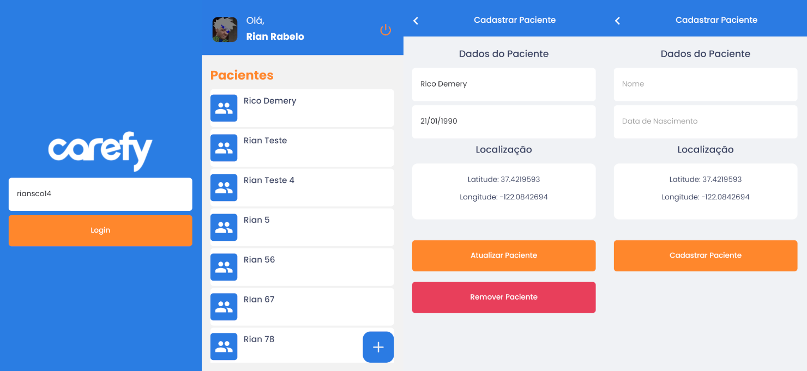

## Desafio Front End Mobile

O desafio tem como objetivo avaliar a pessoa candidata nas experiências: 
* Criação de layouts
* Padrões no uso do React Native
* Boas práticas de programação e organização de projeto

### Aplicativo Criado ( Imagens do aplicativo em funcionamento )

## Requisitos

### Obrigatório
- Styled-components ou Stylesheet ✅
- Redux  ✅
- Axios  ✅
- Yup  ✅
- Redux-toolkit  ✅
- TypeScript ✅
- Utilizar react navigation ✅

